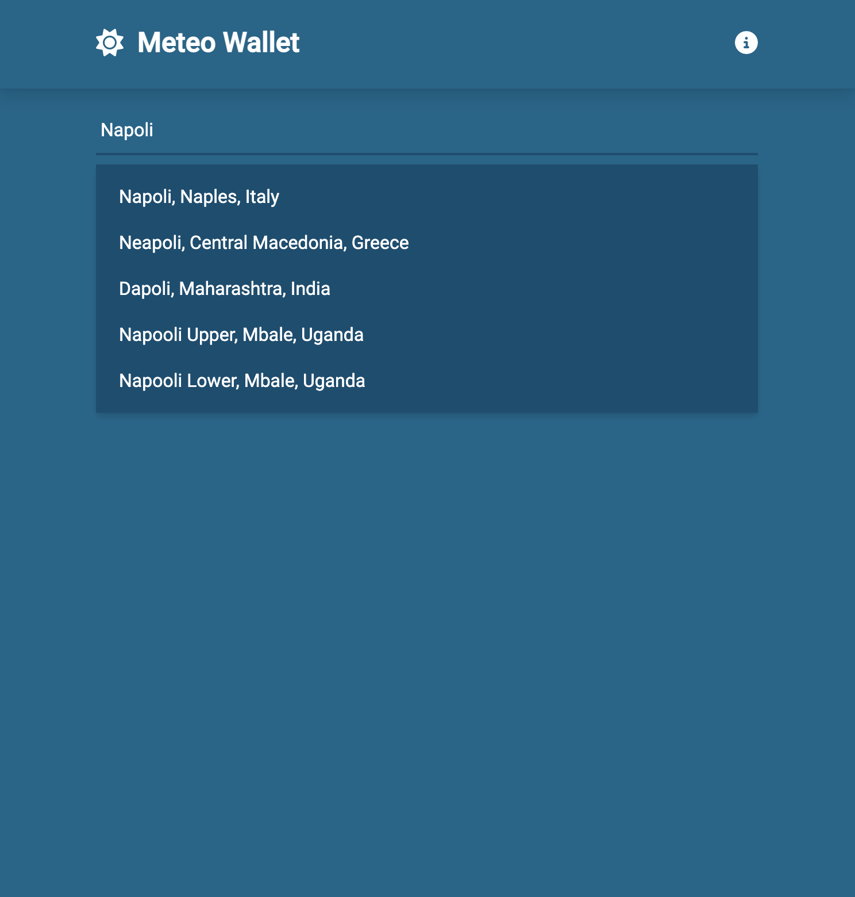
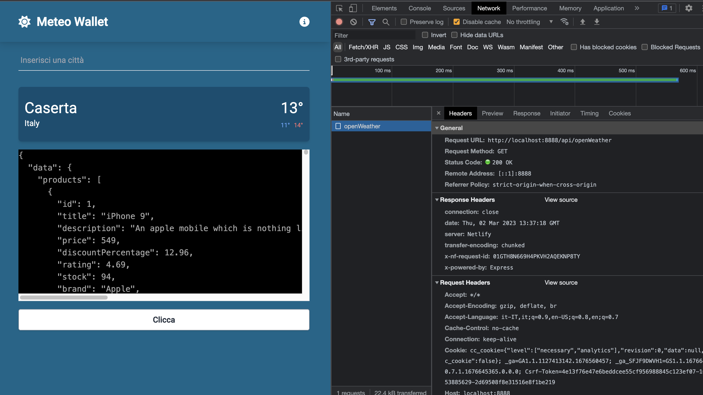

# vue-weather-app

<div style="text-align: center;">
    
</div>

Applicativo per conoscere le previsione meteorologiche su base oraria e settimanale con la possibilità 
di anggiungere (ed eliminare) in un proprio wallet i posti preferiti.

## Specifiche Tecniche
- Framework Js: Vue 3 in Composition API
- Framework CSS: Tailwind CSS
- Database usato: localStorage del Browser
- API: [MapBox](https://www.mapbox.com/) + [OpenWeather](https://openweathermap.org/)

## Project Setup

Fare il clone del progetto e rimanere sul branch **main** \
Da terminale lanciare:
```sh
npm install
```

### Creare il file **.env.local** nell root del progetto ed inserire le seguenti rige inserendo le proprie API key:

```sh
VITE_OPEN_WEATHER_API_KEY=
VITE_MAPBOX_API_KEY=
```
<small><b style="color: darkred;">NB:</b> I servizi anche per il piano gratuito richiedono i dati della carta. Nessuna somma verrà detratta.</small>

### Compile and Hot-Reload for Development

```sh
npm run dev
```

### Compile and Minify for Production

```sh
npm run build
```

## **DETTAGLI**
L'applicazione è pronta per essere deployata ma fai attenzione perchè allo stato attuale, avendo fatto tutto lato client, saranno esposte anche le proprie API KEY. (Se vai nella scheda Network vedrai le richieste GET effettuate con il relativo token).

### **Come risolvere?**
Spostiamoci nel branch: **develop** \
Ecco, qui come vedremo abbiamo usato le functions di Netlify (analogamente abbiamo le functions anche per Cloudflarere Pages, oppure usare Cloudflare Walkers) che permettono di costruire un applicazione Full-stack in modalità serverless utilizzando praticamente node.js in modo del tutto gratuito.

In questo caso installare globalmente Netlify-Cli (se si lavora in team e si usa una pipeline CI/CD è consigliato metterlo localmente).

```sh
npm install netlify-cli -g
```

a questo punto al posto di lanciare **npm run dev**, basterà lanciare:
```sh
ntl dev
```
<div style="text-align: center;">
    
</div>

Come possiamo vedere dall'immagine, cliccando sul bottone faremo una richiesta a /api/openWeather lavorando in questo modo potremo praticamente lavorare in modalità serverless senza esporci lato client.
In questo caso abbiamo usato le API di [DUMMYJSON](https://dummyjson.com/) solo per prendere dei dati fittizi ma possiamo riportare praticamente le chiamate fatte a MapBox ed OpenWeather per non esporre l'API KEY lato client.
Da backoffice sia Cloudflare che Netlify consentiranno di inserire delle variabili d'ambiente.